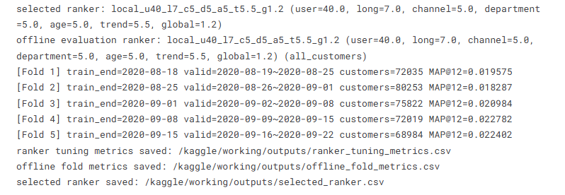
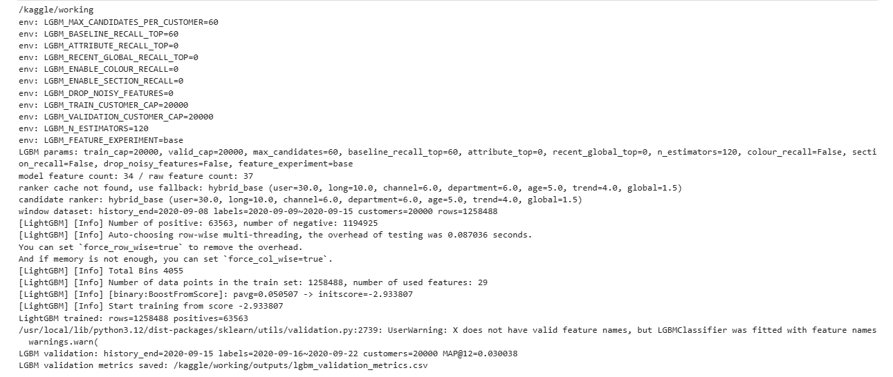
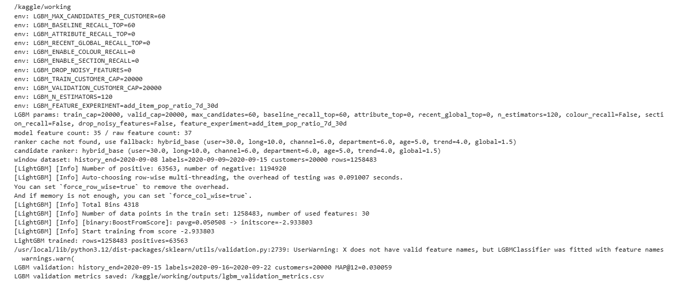
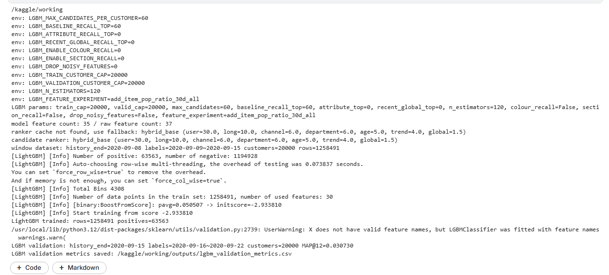
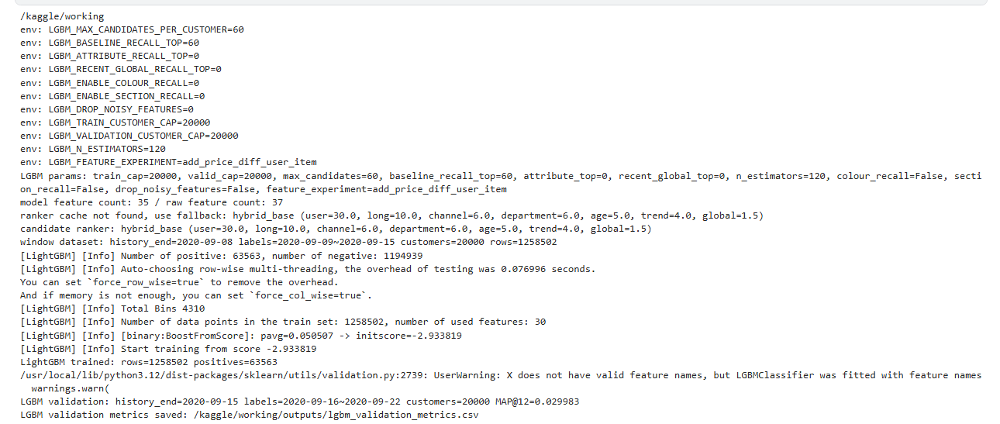

# H&M 推荐系统本地验证与新特征消融实验报告

## 1. 实验背景

本报告基于期末大作业 Kaggle H&M 推荐系统项目完成两个小实验：

1. 防穿越的本地验证：使用时间顺序切分验证集，保证验证集时间晚于训练集时间，并记录最简单 Baseline 模型的 Local CV 与 Kaggle Public LB 分数。
2. 新特征消融实验：选取最近新增的 3 个 LightGBM 特征，遵循“一次只加一个变量”的原则，分别加入模型并记录 Local CV MAP@12 变化。

评价指标统一使用 Kaggle H&M 赛题指标 `MAP@12`。

## 2. 防穿越的本地验证

### 2.1 验证集切分方式

本项目使用**按时间顺序切分**的本地验证方式，而不是随机打乱数据。代码中的验证逻辑为：

```text
训练集：只使用验证窗口开始之前的历史交易
验证集：训练截止日之后未来 7 天的真实购买记录
```

例如最后一折验证为：

```text
train_end   = 2020-09-15
valid_start = 2020-09-16
valid_end   = 2020-09-22
```

这说明模型在训练时只能看到 `2020-09-15` 及以前的数据，再预测 `2020-09-16` 到 `2020-09-22` 的用户购买行为，符合“用过去预测未来”的推荐系统场景。

### 2.2 Baseline 本地验证结果

最简单 Baseline 使用 `Final_Project.py` 中的规则融合推荐器，并通过 `Final_Project_Eval.py` 进行权重调参和 5 折时间窗口验证。最终选择的规则权重为：

```text
local_u40_l7_c5_d5_a5_t5.5_g1.2
user=40.0, long=7.0, channel=5.0, department=5.0, age=5.0, trend=5.5, global=1.2
```

5 折本地验证结果如下：

| Fold | 训练截止日 | 验证窗口 | 验证用户数 | MAP@12 |
|---:|---|---|---:|---:|
| 1 | 2020-08-18 | 2020-08-19 ~ 2020-08-25 | 72035 | 0.019575 |
| 2 | 2020-08-25 | 2020-08-26 ~ 2020-09-01 | 80253 | 0.018287 |
| 3 | 2020-09-01 | 2020-09-02 ~ 2020-09-08 | 75822 | 0.020984 |
| 4 | 2020-09-08 | 2020-09-09 ~ 2020-09-15 | 72019 | 0.022782 |
| 5 | 2020-09-15 | 2020-09-16 ~ 2020-09-22 | 68984 | 0.022402 |

Baseline 的 Local CV 与线上分数如下：

| 模型 | 本地验证方式 | Local CV MAP@12 | Public LB | Private LB |
|---|---|---:|---:|---:|
| 规则融合 Baseline | 5 折时间顺序验证，每折验证未来 7 天 | 0.020806 | 0.01828 | 0.01841 |




### 2.3 为什么不能使用随机打乱交叉验证

推荐系统预测的是用户未来的购买行为，用户兴趣、商品热度、季节趋势和新品生命周期都强烈依赖时间。如果把交易记录随机打乱做交叉验证，训练集中可能会混入验证时间之后的购买记录，模型等于提前看到了未来的热门商品、用户偏好变化和商品趋势，这会造成严重的数据穿越。

随机打乱交叉验证得到的本地分数通常会虚高，因为它不再模拟真实线上场景。线上提交时模型只能使用测试期之前的数据预测未来购买，因此本地验证也必须按时间顺序切分，保证训练集时间早于验证集时间。

## 3. 新特征单变量消融实验

### 3.1 实验设计

本实验选取最近新增的 3 个 LightGBM 特征：

| 特征 | 含义 |
|---|---|
| `item_pop_ratio_7d_30d` | 商品近 7 天销量与近 30 天销量的比例，用于刻画短期趋势增强 |
| `item_pop_ratio_30d_all` | 商品近 30 天销量与全历史销量的比例，用于刻画近期热度占比 |
| `price_diff_user_item` | 用户历史平均购买价格与商品平均价格的差值，用于刻画价格匹配程度 |

实验遵循“一次只加一个变量”的原则：

1. 先跑基础模型 `base`，不包含以上 3 个新特征。
2. 在基础模型上只加入 `item_pop_ratio_7d_30d`。
3. 在基础模型上只加入 `item_pop_ratio_30d_all`。
4. 在基础模型上只加入 `price_diff_user_item`。

实验中固定候选召回和 LightGBM 参数，只改变特征开关：

```text
LGBM_FEATURE_EXPERIMENT=base
LGBM_FEATURE_EXPERIMENT=add_item_pop_ratio_7d_30d
LGBM_FEATURE_EXPERIMENT=add_item_pop_ratio_30d_all
LGBM_FEATURE_EXPERIMENT=add_price_diff_user_item
```

本地验证仍然采用时间顺序验证，避免未来数据穿越。

### 3.2 消融结果

4 次实验得到的 Local CV MAP@12 分数为：

```text
base                              = 0.030038
+ item_pop_ratio_7d_30d           = 0.030059
+ item_pop_ratio_30d_all          = 0.030730
+ price_diff_user_item            = 0.029983
```

以 `base = 0.030038` 为基础分数，计算每个新特征的边际变化：

| 特征名字 | 加入后的 Local CV MAP@12 | 分数变化量 | 决策 |
|---|---:|---:|---|
| `item_pop_ratio_7d_30d` | 0.030059 | +0.000021 | 暂时保留，但贡献很小 |
| `item_pop_ratio_30d_all` | 0.030730 | +0.000692 | 保留 |
| `price_diff_user_item` | 0.029983 | -0.000055 | 删除 / 暂不加入最终模型 |






### 3.3 消融结论

从实验结果看，`item_pop_ratio_30d_all` 带来了最明显的提升，Local CV MAP@12 从 `0.030038` 提升到 `0.030730`，变化量为 `+0.000692`，说明商品近期热度占全历史热度的比例对推荐排序有明显帮助，应当保留。

`item_pop_ratio_7d_30d` 的分数只提升了 `+0.000021`，贡献非常小，但方向为正，可以暂时保留，后续需要结合更多时间窗口继续验证其稳定性。`price_diff_user_item` 加入后分数下降 `-0.000055`，说明用户均价与商品均价差距在当前验证设置下没有带来收益，可能引入噪声，因此暂时不建议放入最终模型。

## 4. 最终结论

本次实验首先验证了项目中的本地验证流程是防穿越的：训练集始终早于验证集，验证窗口模拟未来 7 天购买行为，符合 H&M 推荐系统“用过去预测未来”的业务场景。规则融合 Baseline 的本地 5 折时间验证 MAP@12 为 `0.020806`，线上 Public LB 为 `0.01828`。

新特征消融实验表明，3 个新增特征中最有价值的是 `item_pop_ratio_30d_all`，它显著提升了本地验证 MAP@12；`item_pop_ratio_7d_30d` 只有极小正贡献，可以暂时保留；`price_diff_user_item` 在本地验证中造成分数下降，建议删除或暂不用于最终模型。

因此，后续模型优化应优先保留与商品近期热度相关的特征，谨慎使用价格匹配类特征，并继续坚持时间顺序验证，避免随机打乱带来的数据穿越和分数虚高。
