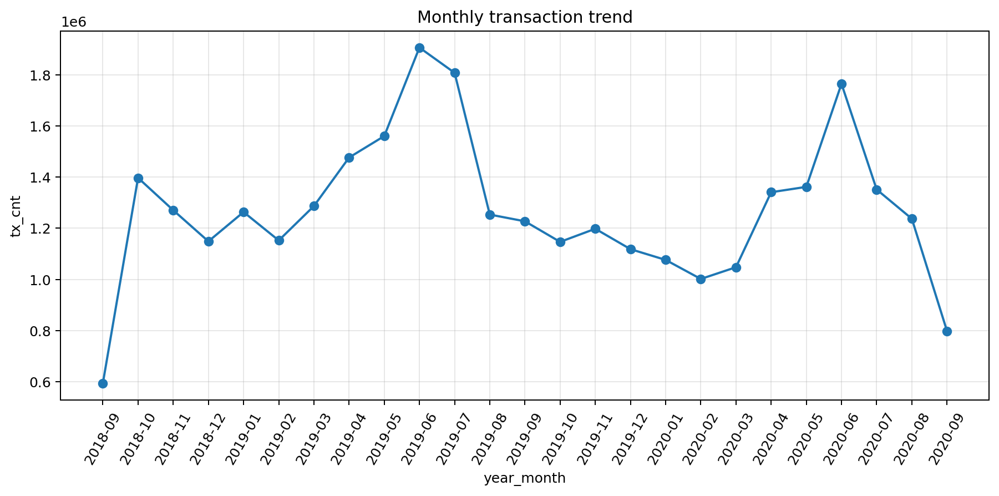
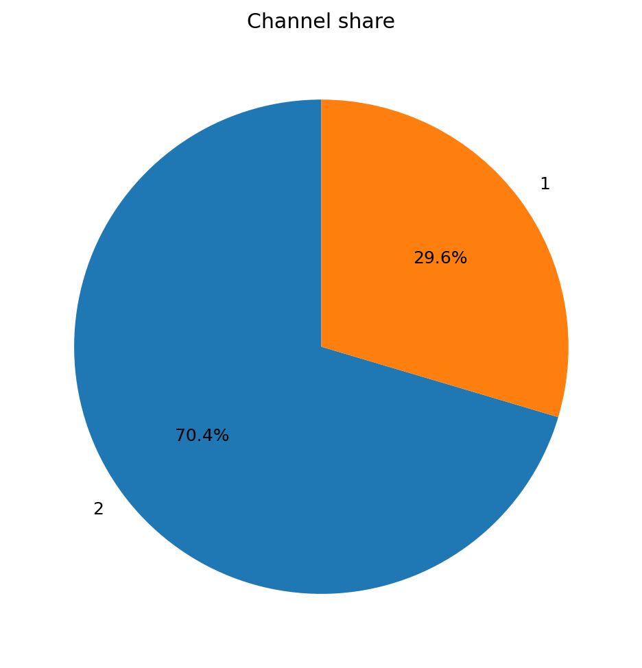
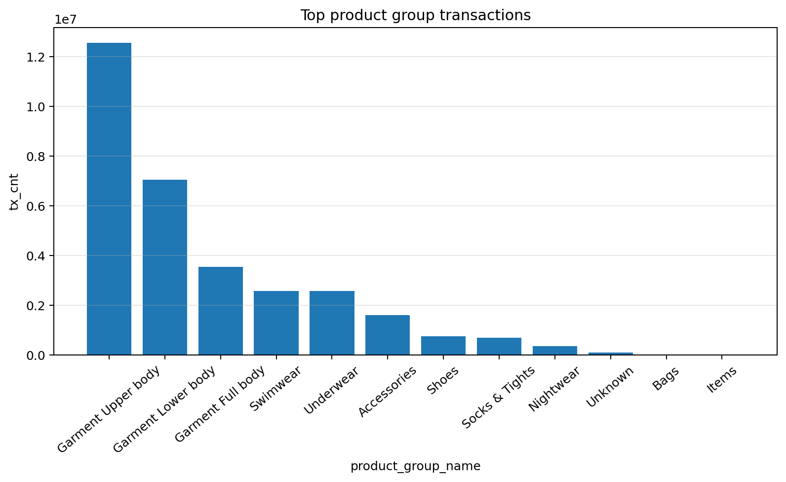
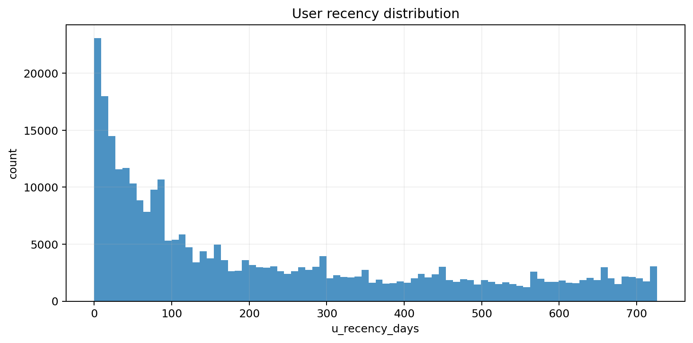
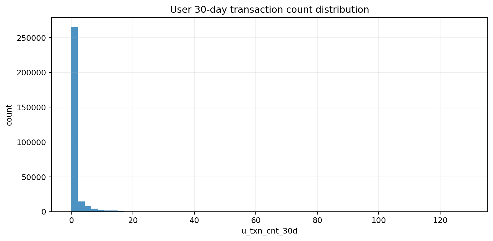
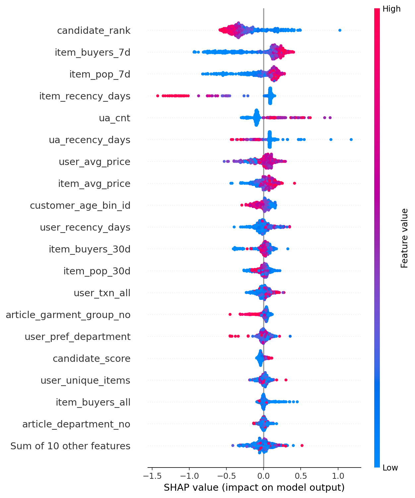
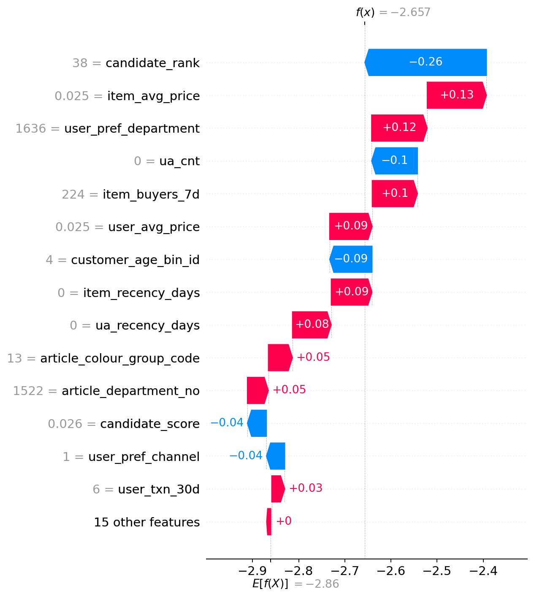

# H&M 个性化推荐系统数据分析报告

> **课程**：大数据分析与计算 (610ZH125)  
> **团队**：第一组 · 组员：王鹏 曹睿杰  
> **竞赛**：Kaggle - H&M Personalized Fashion Recommendations  
> **项目仓库**：请填写 GitHub 仓库链接  
> **报告用途**：期末大作业报告与答辩 PPT 依据  
> **日期**：2026 年 5 月

---

## 一、Executive Summary

本项目围绕 Kaggle H&M 个性化推荐赛题展开，目标是基于用户历史交易、客户画像和商品元数据，为每位顾客预测未来 7 天最可能购买的 12 件商品。项目最终采用“规则召回 + LightGBM 重排序”的两阶段推荐架构：先用多路规则召回生成候选集，再用 LightGBM 对候选商品进行个性化排序，并用 Kaggle 官方指标 `MAP@12` 评估推荐效果。

项目从 EDA 出发，发现 H&M 服装消费具有明显的短期趋势、季节波动、用户活跃度差异和冷启动问题。因此，模型迭代重点从单纯热门推荐，逐步扩展到用户历史召回、趋势热门、商品共现召回、候选集扩容和冷启动增强。最终最佳线上结果达到：

| 阶段 | 方法 | Local MAP@12 | Private Score | Public Score |
|:---|:---|---:|---:|---:|
| 规则融合 Baseline | 多路规则召回 + 权重调参 | 0.020806 | 0.01841 | 0.01828 |
| 早期 LightGBM | 规则候选 + LGBM 重排序 | 约 0.0309 | 约 0.02717 | 约 0.02679 |
| 候选集 150 原版 | 150 候选 + 共现召回 | 约 0.0318 | 0.02782 | 0.02763 |
| 最终版本 | 150 候选 + 共现召回 + 冷启动增强 | 0.032091 | **0.02826** | **0.02814** |

> **截图占位 1**：插入最终 Kaggle 提交结果截图，显示 Private `0.02826` / Public `0.02814`。  
> **截图占位 2**：插入最终 Kaggle Notebook 运行日志截图，包含 `LGBM validation ... MAP@12=0.032091`。

最终结论是：H&M 推荐任务不是简单的“全局热门商品排序”，而是需要在用户历史偏好、短期流行趋势、候选覆盖率和冷启动用户画像之间取得平衡。项目中提升最明显的方向是：扩大候选集到 150、加入轻量商品共现召回，并针对无历史/弱历史用户加入冷启动画像热门召回。

---

## 二、项目背景与赛题理解

### 2.1 业务问题

H&M 是典型的服装零售场景，商品变化快，用户购买行为受季节、流行趋势、年龄、渠道、品类和近期行为影响明显。推荐系统需要解决的问题是：

```text
给定历史交易、客户信息和商品信息，为每个 customer_id 推荐最多 12 个 article_id。
```

在业务上，推荐系统需要同时满足三点：

1. **覆盖全部用户**：提交文件必须包含 sample submission 中所有用户。
2. **命中未来购买**：推荐结果应尽可能包含未来 7 天真实购买商品。
3. **排序靠前**：命中的商品越靠前，MAP@12 得分越高。

### 2.2 数据集概况

| 数据表 | 记录数 | 关键字段 | 作用 |
|:---|---:|:---|:---|
| `transactions_train.csv` | 31,788,324 | `t_dat`, `customer_id`, `article_id`, `price`, `sales_channel_id` | 用户历史购买行为 |
| `customers.csv` | 1,371,980 | `customer_id`, `age`, `club_member_status`, `fashion_news_frequency`, `postal_code` | 用户画像与冷启动信息 |
| `articles.csv` | 105,542 | `article_id`, `product_type_name`, `department_no`, `colour_group_name`, `garment_group_name` | 商品属性与召回特征 |
| `sample_submission.csv` | 1,371,980 | `customer_id`, `prediction` | 提交用户范围和格式 |

交易时间范围为：

```text
2018-09-20 ~ 2020-09-22
```

> **截图占位 3**：插入 Kaggle 数据集文件列表截图。  
> **截图占位 4**：插入 notebook 中数据表 shape / schema 输出截图。

### 2.3 评价指标

Kaggle 官方指标为 `MAP@12`，即 Mean Average Precision at 12。它不仅看推荐列表里是否命中真实购买商品，也看命中商品在列表中的位置。

本项目所有本地验证和模型选择都围绕 `MAP@12` 展开。

---

## 三、EDA 分析与业务洞察

EDA 对应项目第一阶段，主要文件为：

```text
EDA_Checkpoint.ipynb
doc_images/
```

### 3.1 数据质量诊断

EDA 首先对缺失值、重复记录、字段类型和表连接覆盖率进行了检查，主要发现如下：

| 诊断项 | 发现 | 后续处理 |
|:---|:---|:---|
| 交易重复 | `transactions` 中存在较多重复交易记录 | EDA 中同时关注原始口径和清洗口径 |
| 年龄缺失 | `customers.age` 存在缺失 | 用中位数填充，并构造年龄段 |
| 商品关联 | 交易表与商品表 join 覆盖较好 | 可以放心使用商品属性特征 |
| 价格分布 | `price` 呈长尾 | 保留原值，同时在后续讨论中考虑稳健变换 |

> **截图占位 5**：插入数据质量诊断结果截图，如缺失率、重复率或 join 覆盖率。

### 3.2 时间趋势

EDA 发现交易量存在明显的时间趋势和季节波动。服装消费具有较强季节性，近期热门商品往往更能预测下一周购买行为。



对模型的启发：

- 构造 `item_pop_7d`、`item_pop_30d`、`item_buyers_7d` 等近期热度特征。
- 构造 `item_pop_ratio_7d_30d` 和 `item_pop_ratio_30d_all` 描述商品近期热度占比。
- 规则召回中加入趋势热门和近 7 天全局热门。

### 3.3 渠道与品类差异

不同销售渠道和商品品类的购买结构存在明显差异。线上/线下渠道行为不同，热门商品组也呈现头部集中。





对模型的启发：

- 规则 Baseline 加入渠道热门、部门热门、年龄段热门。
- LightGBM 使用商品部门、商品类型、服装组、颜色组等结构化属性。
- 后续候选召回中保留 `product_type`、`garment_group` 等较稳健属性，默认关闭噪声较大的 `colour` 和 `section` 召回。

### 3.4 用户活跃度与冷启动问题

用户活跃度差异很大。一部分用户近期购买频繁，另一部分用户历史行为很少甚至没有历史交易。活跃用户适合利用近期历史和共现召回，冷启动用户则需要依赖客户画像和热门兜底。





对模型的启发：

- 对活跃用户：重点使用用户近期历史、长期历史、用户-商品交互和商品共现召回。
- 对弱历史用户：使用年龄段、会员状态、新闻订阅频率组合下的近期热门商品。
- 对完全无历史用户：使用趋势热门、全局热门和画像热门作为兜底。

### 3.5 EDA 结论

EDA 最终形成了四条建模原则：

1. **必须按时间验证**：不能随机打乱，否则会泄露未来趋势。
2. **近期热度很关键**：服装商品流行周期短，近 7/30 天信号重要。
3. **候选召回决定上限**：真实商品不进候选集，排序模型无法命中。
4. **冷启动需要单独处理**：大量用户历史稀疏，仅靠用户历史召回不够。

---

## 四、方法设计与系统架构

### 4.1 整体流程

项目最终流程如下：

```text
原始数据读取
  ↓
EDA 与数据质量诊断
  ↓
规则融合 Baseline
  ↓
时间窗口 Local CV 验证
  ↓
LightGBM 候选排序模型
  ↓
共现召回与冷启动增强
  ↓
消融实验与 SHAP 可解释性
  ↓
生成 submission.csv
  ↓
提交 Kaggle 并记录线上分数
```

### 4.2 文件职责

| 文件 | 作用 | 答辩说明 |
|:---|:---|:---|
| `EDA_Checkpoint.ipynb` | EDA、质量诊断、业务洞察 | 支撑特征设计与验证策略 |
| `Final_Project.py` | 规则融合 Baseline，生成提交文件 | 稳定 baseline 和兜底推荐 |
| `Final_Project_Eval.py` | 规则 Baseline 的时间窗口验证与权重调参 | 说明如何防穿越和调权重 |
| `Final_Project_LGBM.py` | LightGBM 候选排序主模型 | 最终提分主脚本 |
| `LGBM_Ablation_SHAP_Analysis.py/ipynb` | 消融实验与 SHAP 分析 | 模型可解释性 |
| `experiments/` | 记录离线 run 和线上 Kaggle 分数 | 保证实验可追踪 |
| `homework/` | 报告、消融表、SHAP 图 | 课程交付材料 |

### 4.3 为什么使用“规则召回 + LightGBM 排序”

H&M 数据规模很大，不能直接对所有用户和所有商品做全量组合：

```text
1,371,980 users × 105,542 articles
```

因此项目采用两阶段架构：

1. **召回阶段**：为每个用户生成几十到一百多个候选商品。
2. **排序阶段**：用 LightGBM 对候选商品打分，取前 12 个输出。

这个架构的优点是：

- 计算可控，适合 Kaggle CPU 环境。
- 可以融合业务规则和机器学习模型。
- 便于针对冷启动、共现、热门趋势做模块化优化。

---

## 五、防穿越本地验证

### 5.1 验证方式

推荐系统预测的是未来购买行为，因此本项目坚持使用时间顺序切分：

```text
训练集：验证窗口开始之前的历史交易
验证集：训练截止日之后未来 7 天真实购买
```

最后一折示例：

```text
train_end   = 2020-09-15
valid_start = 2020-09-16
valid_end   = 2020-09-22
```

这样可以模拟线上场景：只能用过去预测未来。

### 5.2 为什么不能随机打乱

如果随机打乱交易记录，训练集中可能出现验证期之后的购买行为。模型等于提前知道未来哪些商品会变热门、用户兴趣会如何变化，这会造成严重数据穿越。本地分数会虚高，但线上提交会下降。

### 5.3 规则 Baseline 5 折验证

规则 Baseline 使用最近 5 个 7 天验证窗口，最终权重为：

```text
local_u40_l7_c5_d5_a5_t5.5_g1.2
user=40.0, long=7.0, channel=5.0, department=5.0, age=5.0, trend=5.5, global=1.2
```

| Fold | 训练截止日 | 验证窗口 | 用户数 | MAP@12 |
|---:|:---|:---|---:|---:|
| 1 | 2020-08-18 | 2020-08-19 ~ 2020-08-25 | 72,035 | 0.019575 |
| 2 | 2020-08-25 | 2020-08-26 ~ 2020-09-01 | 80,253 | 0.018287 |
| 3 | 2020-09-01 | 2020-09-02 ~ 2020-09-08 | 75,822 | 0.020984 |
| 4 | 2020-09-08 | 2020-09-09 ~ 2020-09-15 | 72,019 | 0.022782 |
| 5 | 2020-09-15 | 2020-09-16 ~ 2020-09-22 | 68,984 | 0.022402 |

平均：

```text
Local CV MAP@12 = 0.020806
```

> **截图占位 6**：插入 `Final_Project_Eval.py` 5 折验证日志截图。  
> **截图占位 7**：插入规则 Baseline Kaggle 分数截图。

---

## 六、模型迭代过程

### 6.1 规则融合 Baseline

规则 Baseline 的召回来源包括：

| 召回来源 | 作用 |
|:---|:---|
| 用户近期历史 | 捕捉短期复购和近期偏好 |
| 用户长期历史 | 捕捉稳定兴趣 |
| 渠道热门 | 区分线上/线下行为 |
| 部门热门 | 捕捉用户常买部门 |
| 年龄段热门 | 增加人群个性化 |
| 趋势热门 | 捕捉近期流行商品 |
| 全局热门 | 冷启动兜底 |

每一路使用一个权重进行加权融合：

```text
score += source_weight / rank_in_source
```

`Final_Project_Eval.py` 先评估预设权重组，再围绕最优权重做局部搜索，最终将最佳权重保存到：

```text
outputs/selected_ranker.csv
```

### 6.2 LightGBM baseline

在规则候选基础上，`Final_Project_LGBM.py` 构造 customer-article 候选训练集，用未来 7 天真实购买作为标签：

```text
label = 1：该用户在验证窗口购买了该商品
label = 0：候选中未购买商品
```

模型使用 `LGBMClassifier`，主要特征包括：

| 特征类型 | 示例 |
|:---|:---|
| 候选来源特征 | `source_baseline`, `source_product_type`, `source_recent_global` |
| 用户特征 | `user_txn_all`, `user_txn_30d`, `user_recency_days` |
| 商品热度 | `item_pop_7d`, `item_pop_30d`, `item_buyers_7d` |
| 用户-商品交互 | `ua_cnt`, `ua_recency_days` |
| 商品属性 | `article_product_type_no`, `article_garment_group_no` |
| 趋势比例 | `item_pop_ratio_7d_30d`, `item_pop_ratio_30d_all` |

早期 LightGBM 将线上分数从规则 Baseline 的约 `0.018` 提升到约 `0.027`。

### 6.3 候选集扩容

最初候选集较小，候选覆盖不足。后续尝试将候选集从 80/100 扩大到 120、150。实验发现：

| 版本 | 关键设置 | Local MAP@12 | Private | Public | 结论 |
|:---|:---|---:|---:|---:|:---|
| 120 候选 | `max_candidates=120`, `baseline_top=90` | 0.032063 | 0.02774 | 0.02767 | 明显优于早期版本 |
| 150 候选 | `max_candidates=150`, `baseline_top=100` | 约 0.0318 | 0.02782 | 0.02763 | Private 更好，说明候选扩容有效 |
| 150 强 baseline | `baseline_top=120` | 0.032046 | 0.02748 | 0.02774 | Public 高但 Private 掉，过保守 |

结论：候选集扩大确实有帮助，但不是越大越好。扩大候选必须控制噪声，不能让低质量属性召回挤掉高质量候选。

### 6.4 商品共现召回

为提升候选覆盖率，项目加入轻量商品共现召回：

```text
同一用户同一天一起购买过的商品，认为存在搭配或共购关系。
```

实现上只统计近 30 天购物篮，并限制购物篮大小，避免组合爆炸：

```text
LGBM_ENABLE_COOCCURRENCE_RECALL=1
LGBM_COOCCURRENCE_RECALL_TOP=20
```

共现召回主要帮助有历史行为的用户，能够从用户最近买过的商品扩展到可能搭配购买的商品。

### 6.5 冷启动增强召回

最终提升最明显的是冷启动增强。原模型对无历史/弱历史用户主要依赖趋势热门和全局热门，个性化不足。最终版本增加了画像分组热门召回：

| 冷启动画像 | 说明 |
|:---|:---|
| 年龄段 | 如 18-24、25-34、35-44 |
| 会员状态 | `club_member_status` |
| 新闻订阅频率 | `fashion_news_frequency` |
| 组合画像 | 年龄段 + 会员状态 + 新闻订阅频率 |

冷启动增强的关键设置：

```text
LGBM_MAX_CANDIDATES_PER_CUSTOMER=150
LGBM_BASELINE_RECALL_TOP=100
LGBM_COOCCURRENCE_RECALL_TOP=20
LGBM_ENABLE_COLD_START_RECALL=1
LGBM_COLD_START_HISTORY_MAX_ITEMS=2
LGBM_COLD_START_RECALL_TOP=18
LGBM_ENABLE_POSTAL_COLD_START_RECALL=0
LGBM_N_ESTIMATORS=450
```

线上分数从 150 原版的：

```text
Private 0.02782 / Public 0.02763
```

提升到：

```text
Private 0.02826 / Public 0.02814
```

说明冷启动/弱历史用户画像召回是本项目最有效的后期优化方向。

> **截图占位 8**：插入 150 候选原版 Kaggle 分数截图。  
> **截图占位 9**：插入冷启动增强版 Kaggle 分数截图。  
> **截图占位 10**：插入冷启动增强版 Kaggle 日志截图，显示参数和本地 MAP@12。

---

## 七、一步一步优化的过程复盘

这一部分是本项目最重要的实践过程。模型不是一次写完就得到最终分数，而是在不断提交、观察、失败、定位问题、再调整中逐步提升的。整个过程可以概括为：

```text
先跑通 baseline
  ↓
发现分数低，补时间验证和调参
  ↓
引入 LightGBM 重排序
  ↓
发现候选不足，扩大候选集
  ↓
发现噪声变多，控制候选来源比例
  ↓
发现本地和线上不完全一致，结合 Private/Public 判断泛化
  ↓
发现弱历史用户影响大，加入冷启动增强
  ↓
得到最终最佳结果
```

### 7.1 第一步：先保证完整流程能跑通

最开始的目标不是追高分，而是先把 Kaggle 提交流程打通。`Final_Project.py` 实现了规则推荐 Baseline，保证：

- 能读取 Kaggle 数据。
- 能为所有 `customer_id` 生成推荐。
- 每个用户最多 12 个商品。
- 输出 `submission.csv` 格式正确。

这个阶段的收获是：推荐比赛首先要保证工程闭环。没有稳定的提交文件，后面所有模型优化都无法验证。

### 7.2 第二步：用时间验证修正规则权重

跑通 Baseline 后，发现仅靠默认规则权重分数较低。于是将 `Final_Project.py` 和 `Final_Project_Eval.py` 拆开：

- `Final_Project.py` 只负责生成提交。
- `Final_Project_Eval.py` 负责离线验证和权重调参。

调参方式是先评估多组预设权重，再围绕最优权重做局部搜索。例如用户近期历史、长期历史、渠道热门、部门热门、年龄段热门、趋势热门、全局热门都有对应权重。

这个阶段的关键认识是：规则模型虽然简单，但权重不能凭感觉定，必须用时间窗口 MAP@12 验证。

### 7.3 第三步：引入 LightGBM，但不破坏稳定 Baseline

规则 Baseline 的线上分数大约在 `0.018` 左右，提升空间明显。于是新增 `Final_Project_LGBM.py`，保留原规则脚本不变，在规则候选基础上加入 LightGBM 重排序。

这个阶段的变化是：

```text
规则直接排序
  → 规则先召回候选，LightGBM 再排序
```

LightGBM 早期版本将线上分数提升到约 `0.027`，说明机器学习重排序明显优于纯规则。

这个阶段的收获是：在推荐系统里，规则召回和机器学习排序不是互相替代，而是分工合作。

### 7.4 第四步：发现候选集是分数上限

最初 LightGBM 分数提升后，继续优化时发现一个问题：如果真实购买商品没有进入候选集，LightGBM 再强也不可能命中。因此开始扩大候选集。

候选数从 80/100 扩到 120，再扩到 150，结果显示：

| 尝试 | 现象 | 结论 |
|:---|:---|:---|
| 120 候选 | 线上明显提升 | 扩大候选有效 |
| 150 候选 | Private 进一步提升 | 候选覆盖仍有价值 |
| 150 强 baseline | Public 高，但 Private 掉 | 候选来源比例也很重要 |

这个阶段一开始容易误以为“候选越多越好”，但实验说明不是这样。候选太多会带来噪声，LightGBM 可能把噪声排进前 12。

这个阶段的收获是：推荐系统的候选集既要有覆盖率，也要有质量。

### 7.5 第五步：尝试加树，发现本地不等于线上

在 120 候选版本上，将 LightGBM 树数量从 450 增加到 600，本地 MAP@12 从 `0.032063` 提升到 `0.032235`。按直觉看这似乎更好，但线上分数并没有同步提升，甚至不如 450 树版本。

这个失败非常重要，因为它说明：

```text
单窗口 Local CV 可以指导方向，但不能完全代表 Kaggle 测试集。
```

后续模型选择不再只看本地 MAP@12，而是同时关注：

- Local MAP@12 是否明显变好。
- Public 是否提升。
- Private 是否稳定。
- 改动是否符合业务逻辑。

这个阶段的收获是：模型优化不能只看一个指标，要判断它是否真的泛化。

### 7.6 第六步：加入商品共现召回

为了提升活跃用户的候选覆盖，加入了轻量共现召回。做法是统计近 30 天内同一用户同一天共同购买的商品，用“买过 A 的人也常买 B”的逻辑补充候选。

共现召回没有使用图片，也没有使用复杂 embedding，而是基于交易数据构造轻量 item-item 关系。它的优点是：

- 计算量可控。
- 业务解释清楚。
- 对有历史行为的用户有帮助。

这个阶段的收获是：结构化交易数据本身就能挖出商品搭配关系，不一定一开始就要上复杂模型。

### 7.7 第七步：定位冷启动问题并最终提分

在候选集和共现召回优化后，继续分析发现：很多用户历史行为很少，模型对这类用户主要依赖全局热门和趋势热门，个性化不足。

于是加入冷启动增强召回：

```text
年龄段
会员状态
新闻订阅频率
年龄段 + 会员状态 + 新闻订阅频率
```

对无历史/弱历史用户补充这些画像分组下的近期热门商品。结果线上分数从：

```text
Private 0.02782 / Public 0.02763
```

提升到：

```text
Private 0.02826 / Public 0.02814
```

这是整个后期优化中最明显的一次提升。

这个阶段的收获是：推荐系统不能只服务活跃用户。弱历史用户虽然个体信息少，但数量大，会显著影响最终分数。

### 7.8 优化过程总表

| 阶段 | 做法 | 结果 | 学到的经验 |
|:---|:---|:---|:---|
| 跑通 Baseline | 规则召回生成 submission | 可以提交但分数低 | 先完成工程闭环 |
| 规则调参 | 时间窗口验证 + 权重搜索 | Baseline 达到 0.020806 | 权重需要数据验证 |
| LightGBM | 候选集上训练二分类排序 | 线上约 0.027 | 规则召回 + ML 排序有效 |
| 候选扩容 | 120/150 候选 | 150 Private 更高 | 候选覆盖决定上限 |
| 加树 | 450 → 600 | 本地涨，线上未必涨 | 本地与线上有偏差 |
| 共现召回 | 同日购买商品对 | 候选质量提升 | 交易共现有业务意义 |
| 冷启动增强 | 画像热门召回 | 最终 0.02826 / 0.02814 | 弱历史用户是关键增益 |

> **截图占位 11**：插入模型迭代过程中的多次 Kaggle 提交记录截图。  
> **截图占位 12**：插入不同参数运行日志对比截图，如 120、150、冷启动增强。

---

## 八、消融实验与模型解释

### 8.1 新特征单变量消融

本实验遵循“一次只加一个变量”的原则，比较 3 个新增特征：

```text
base                              = 0.030038
+ item_pop_ratio_7d_30d           = 0.030059
+ item_pop_ratio_30d_all          = 0.030730
+ price_diff_user_item            = 0.029983
```

| 特征 | 加入后 Local MAP@12 | ΔMAP | 决策 |
|:---|---:|---:|:---|
| `item_pop_ratio_7d_30d` | 0.030059 | +0.000021 | 暂时保留 |
| `item_pop_ratio_30d_all` | 0.030730 | +0.000692 | 保留 |
| `price_diff_user_item` | 0.029983 | -0.000055 | 删除 / 默认不使用 |

结论：商品近期热度占比是有效特征，简单价格差异没有带来收益。因此最终 `LGBM_FEATURE_EXPERIMENT=best` 默认保留两个热度比例特征，并去掉 `price_diff_user_item`。

> **截图占位 13**：插入 4 组新特征消融实验日志截图。

### 8.2 Top-5 Gain 特征消融

根据 LightGBM gain 排名，Top-5 特征为：

| Gain 排名 | 特征 | Gain |
|---:|:---|---:|
| 1 | `candidate_rank` | 4,714,382.9331 |
| 2 | `source_baseline` | 304,661.0000 |
| 3 | `candidate_score` | 244,729.3684 |
| 4 | `user_avg_price` | 91,168.2414 |
| 5 | `user_recency_days` | 78,244.2913 |

消融结果：

| 移除特征 | Baseline MAP@12 | 移除后 MAP@12 | 边际贡献 | 判断 |
|:---|---:|---:|---:|:---|
| `source_baseline` | 0.028581 | 0.028162 | +0.000419 | 有正贡献 |
| `candidate_score` | 0.028581 | 0.028457 | +0.000124 | 有正贡献 |
| `user_avg_price` | 0.028581 | 0.028812 | -0.000231 | 伪重要 |
| `user_recency_days` | 0.028581 | 0.029147 | -0.000566 | 伪重要 |
| `candidate_rank` | 0.028581 | 0.029423 | -0.000843 | 伪重要 |

结论：Gain 高不等于真实贡献高。部分特征在树分裂中很活跃，但对最终 MAP@12 可能是负贡献。

### 8.3 SHAP 分析

项目使用 `shap.TreeExplainer` 生成全局蜂群图和局部瀑布图。





SHAP 结果显示模型主要关注三类信号：

1. 候选召回阶段的排序与来源信号。
2. 商品近期热度，如 `item_buyers_7d`、`item_pop_7d`。
3. 用户-商品历史交互，如 `ua_cnt`、`ua_recency_days`。

答辩可解释为：模型学到的不是单一热门逻辑，而是在“规则候选质量、近期商品趋势、用户历史偏好”三者之间做重排序。

> **截图占位 14**：插入 SHAP 蜂群图原图。  
> **截图占位 15**：插入 SHAP 瀑布图原图。

---

## 九、关键实验记录

### 9.1 模型分数演进

| 阶段 | 主要变化 | Local MAP@12 | Private | Public |
|:---|:---|---:|---:|---:|
| 规则 Baseline | 多路规则召回 + 权重调参 | 0.020806 | 0.01841 | 0.01828 |
| 早期 LightGBM | 规则候选 + LGBM 排序 | 约 0.0309 | 约 0.02717 | 约 0.02679 |
| 120 候选 | 候选扩容 + 共现召回 | 0.032063 | 0.02774 | 0.02767 |
| 150 候选 | 进一步扩大候选 | 约 0.0318 | 0.02782 | 0.02763 |
| 150 强 baseline | 提高 baseline 候选占比 | 0.032046 | 0.02748 | 0.02774 |
| 150 + 冷启动增强 | 弱历史用户画像热门召回 | 0.032091 | **0.02826** | **0.02814** |

### 9.2 线上与本地不完全一致

实验中出现了一个重要现象：

```text
本地 MAP@12 更高，不一定线上更高。
```

例如：

- `120 + 600 trees` 本地分数更高，但线上不如 `120 + 450 trees`。
- `150 candidates` 本地略低，但 Kaggle 线上更好。

这说明单窗口 Local CV 与 Kaggle 测试集分布不完全一致。因此后续模型选择不能只看本地分数，也要结合 Private/Public 的泛化表现。

### 9.3 最终最佳配置

最终推荐配置：

```python
%env LGBM_TRAIN_CUSTOMER_CAP=80000
%env LGBM_VALIDATION_CUSTOMER_CAP=60000
%env LGBM_MAX_CANDIDATES_PER_CUSTOMER=150
%env LGBM_BASELINE_RECALL_TOP=100
%env LGBM_ATTRIBUTE_RECALL_TOP=8
%env LGBM_RECENT_GLOBAL_RECALL_TOP=12
%env LGBM_ENABLE_COLOUR_RECALL=0
%env LGBM_ENABLE_SECTION_RECALL=0
%env LGBM_ENABLE_COOCCURRENCE_RECALL=1
%env LGBM_COOCCURRENCE_RECALL_TOP=20
%env LGBM_ENABLE_COLD_START_RECALL=1
%env LGBM_COLD_START_HISTORY_MAX_ITEMS=2
%env LGBM_COLD_START_RECALL_TOP=18
%env LGBM_ENABLE_POSTAL_COLD_START_RECALL=0
%env LGBM_TRAIN_WINDOW_COUNT=1
%env LGBM_FEATURE_EXPERIMENT=best
%env LGBM_DROP_NOISY_FEATURES=0
%env LGBM_N_ESTIMATORS=450
%env LGBM_SUBMISSION_CUSTOMER_CHUNK=6000
```

> **截图占位 16**：插入最终 Kaggle Notebook 环境变量配置截图。  
> **截图占位 17**：插入最终 `submission.csv` 文件生成成功截图。

---

## 十、失败分析与问题解决方法

### 10.1 直接扩大属性召回不稳定

尝试增加 `colour`、`section` 等属性召回后，部分版本 Public 上升但 Private 下降。原因是属性相似不等于购买意愿，过细属性容易引入噪声。

经验：

```text
候选扩展要控制质量，不能只追求数量。
```

### 10.2 候选集并非越大越好

120 到 150 候选有提升，但继续盲目扩大可能使噪声增加。150 强 baseline 版本虽然 Public 高，但 Private 下降，说明过度保守或候选比例不合理也会影响泛化。

经验：

```text
候选集大小和候选来源比例需要共同调节。
```

### 10.3 增加树数量可能过拟合

将 `n_estimators` 从 450 增加到 600，本地 MAP@12 有时提高，但线上分数反而下降。

经验：

```text
更多树不一定更好，线上泛化比单窗口本地分数更重要。
```

### 10.4 价格匹配特征未生效

`price_diff_user_item` 在单变量消融中让本地 MAP@12 下降。可能原因是 H&M 价格已归一化，且短期服装购买更受趋势和品类影响。

经验：

```text
看似合理的业务特征必须用消融验证。
```

### 10.5 冷启动是后期最大增益来源

最终冷启动增强同时提升 Private 和 Public，说明无历史/弱历史用户在测试集中有足够影响。仅用全局热门不足以覆盖这些用户，需要利用客户画像做更细分的热门推荐。

经验：

```text
推荐系统不能只服务活跃用户，弱历史用户会显著影响最终分数。
```

---

## 十一、个人成长与方法论收获

这个项目最大的收获不是单纯把分数从 `0.018` 提到 `0.028`，而是在完整实践中逐渐形成了一套推荐系统优化方法。

### 11.1 从“会跑代码”到“能解释问题”

一开始关注的是代码能不能跑通、submission 能不能生成。后面逐渐意识到，推荐系统不仅要能跑，还要能解释：

- 为什么不能随机划分验证集？
- 为什么候选集太小会限制上限？
- 为什么候选集变大后分数不一定更高？
- 为什么本地分数涨了，线上可能反而下降？
- 为什么冷启动用户会影响整体分数？

这些问题推动我们从“跑脚本”转向“理解推荐系统机制”。

### 11.2 从“盲目调参”到“小步实验”

早期优化时容易觉得参数越大越好，例如增加候选数、增加树数量、增加属性召回。但实验发现：

- 600 树本地更高，线上不一定更好。
- 150 候选比 120 好，但提高 baseline 占比后 Private 下降。
- 属性召回看起来合理，但颜色和 section 可能引入噪声。

因此后续采用小步 A/B 的方法：

```text
一次只改一个主要因素
记录 Local MAP@12
提交 Kaggle 看 Private/Public
对比是否符合业务逻辑
再决定保留或回退
```

这让优化过程更可控，也更容易在答辩中解释。

### 11.3 从“只看模型分数”到“关注数据分布”

冷启动增强带来的显著提升说明，模型分数并不只由活跃用户决定。大量弱历史用户虽然单个信息少，但整体数量大，对最终 MAP@12 有明显影响。

这个发现让我们认识到：

```text
推荐系统不是只优化最容易建模的用户，而要覆盖不同用户群体。
```

最终冷启动增强使用客户画像进行分组热门召回，既没有引入复杂模型，也没有使用图片特征，但取得了明显提升。这说明业务理解和数据分布分析同样重要。

### 11.4 从“相信特征重要性”到“相信消融实验”

LightGBM gain 显示 `candidate_rank`、`user_avg_price`、`user_recency_days` 很重要，但消融发现它们移除后 MAP@12 反而上升。这改变了我们对模型解释的理解：

```text
模型内部重要性不等于业务指标真实贡献。
```

因此，最终采用 gain、SHAP 和 MAP@12 消融结合判断特征，而不是只看某一种重要性排名。

### 11.5 最终形成的问题解决方法

本项目最终沉淀出一套解决推荐问题的方法：

1. **先保证提交闭环**：格式正确、覆盖全用户、可复现。
2. **用 EDA 找业务规律**：时间趋势、用户活跃度、品类偏好、冷启动。
3. **用时间验证防穿越**：所有验证必须模拟“用过去预测未来”。
4. **先召回再排序**：候选集决定上限，排序模型决定前 12 质量。
5. **小步做实验**：一次只改一个主要变量，记录本地和线上。
6. **失败要复盘**：分数下降不是坏事，它能告诉我们噪声来自哪里。
7. **用解释工具校验模型**：消融和 SHAP 帮助判断特征是否真的有效。

> **截图占位 18**：插入一次失败提交和一次成功提交的对比截图。  
> **截图占位 19**：插入实验记录表或 Kaggle 多次提交列表截图。

---

## 十二、项目亮点

### 12.1 工程完整

项目从 EDA、Baseline、离线验证、LightGBM、消融实验、SHAP、Kaggle 提交到实验记录均已覆盖。

### 12.2 防穿越验证

所有本地验证均采用时间切分，符合真实推荐场景，避免随机打乱导致未来数据泄露。

### 12.3 可解释性充分

通过消融实验和 SHAP 分析解释了模型学到的规律，也识别出 gain 高但实际负贡献的伪重要特征。

### 12.4 优化过程可追踪

项目保留了不同阶段的参数、日志、截图和 Kaggle 分数，便于答辩说明“为什么这样优化”。

### 12.5 冷启动优化有效

最终版本通过客户画像热门召回显著提升线上分数，是项目后期最重要的增益点。

---

## 十三、局限性与未来改进

### 13.1 当前局限

1. LightGBM 使用二分类目标，不是真正的排序损失。
2. 本地验证只使用有限窗口，与 Kaggle 测试分布仍有偏差。
3. 候选召回仍以规则为主，缺少 embedding 召回。
4. 图片特征和文本描述暂未进入主模型。
5. 邮编冷启动召回尚未充分验证，存在高基数过拟合风险。

### 13.2 后续改进方向

| 方向 | 说明 |
|:---|:---|
| LGBMRanker | 使用 LambdaRank 等排序目标，直接优化排序关系 |
| 多窗口训练 | 合并多个时间窗口，提高泛化稳定性 |
| Item2Vec / 共购 embedding | 用商品序列学习相似商品召回 |
| 文本特征 | 使用 `detail_desc` 做文本相似召回 |
| 图片特征 | 使用商品图片 embedding 做视觉相似召回 |
| 更细冷启动 | 尝试邮编、会员状态、年龄组合的更稳健分桶 |

答辩中可以说明：本项目目前选择不引入图片特征，优先用结构化数据完成可解释、可运行、可提交的推荐系统；图片和文本特征属于后续扩展方向。

---

## 十四、答辩 PPT 建议结构

建议 PPT 按以下 10 页展开：

| 页码 | 标题 | 内容 |
|---:|:---|:---|
| 1 | 项目背景与任务 | H&M 推荐目标、MAP@12、提交格式 |
| 2 | 数据概况 | 四张表、记录数、时间范围 |
| 3 | EDA 洞察 | 时间趋势、渠道品类、用户活跃度 |
| 4 | 防穿越验证 | 为什么用时间切分，不用随机 K 折 |
| 5 | Baseline 方法 | 多路规则召回和权重调参 |
| 6 | LightGBM 架构 | 候选召回 + 特征构造 + 重排序 |
| 7 | 模型优化过程 | 候选扩容、共现召回、冷启动增强 |
| 8 | 实验结果 | 分数演进表和最终 Kaggle 截图 |
| 9 | 可解释性 | 消融实验、SHAP、伪重要特征 |
| 10 | 总结与展望 | 最终结论、局限性、未来优化 |

> **截图占位 20**：插入 GitHub commit / 分支记录截图。  
> **截图占位 21**：插入项目文件结构截图。  
> **截图占位 22**：插入答辩 PPT 最终结果页截图。

---

## 附录 A：关键产物清单

| 产物 | 路径 |
|:---|:---|
| EDA Notebook | `EDA_Checkpoint.ipynb` |
| 规则 Baseline | `Final_Project.py` |
| 规则验证与调参 | `Final_Project_Eval.py` |
| LightGBM 主模型 | `Final_Project_LGBM.py` |
| SHAP / 消融分析 | `LGBM_Ablation_SHAP_Analysis.py` |
| SHAP / 消融报告 | `homework/HM_LGBM_Ablation_SHAP_Report.md` |
| 本地验证与新特征消融报告 | `homework/HM_Local_CV_Feature_Ablation_Report.md` |
| 实验记录 | `experiments/` |
| EDA 图表 | `doc_images/` |

## 附录 B：团队分工

| 成员 | 主要工作 | 备注 |
|:---|:---|:---|
| 王鹏 | EDA、建模实验、Kaggle 运行、结果分析 | 请按实际情况调整 |
| 曹睿杰 | 代码整理、报告撰写、可视化与答辩材料 | 请按实际情况调整 |

> **截图占位 23**：插入 GitHub contribution / commit history 截图。

## 附录 C：参考资料

- Kaggle H&M Personalized Fashion Recommendations Competition
- LightGBM Documentation
- SHAP Documentation
- H&M 官方数据集说明与 Kaggle Evaluation 规则

---

> **报告自查**：本报告已覆盖数据理解、EDA 洞察、防穿越验证、模型架构、调参过程、消融实验、SHAP 解释、线上结果、失败分析和答辩结构。截图占位处可在最终提交前补充 Kaggle 运行日志、分数截图、GitHub 记录和 Notebook 输出。
